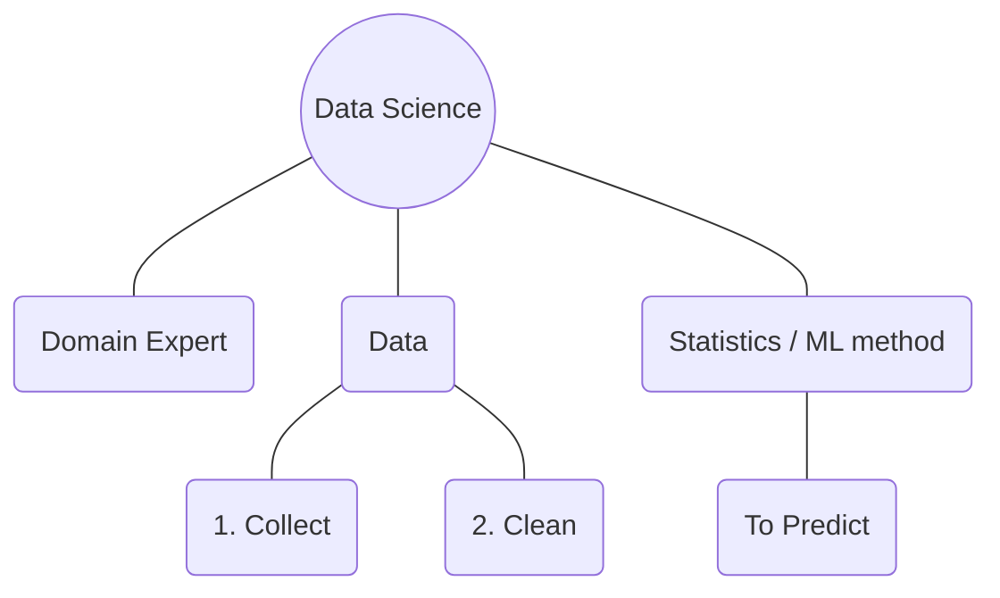

## AI, ML, DS, DA

### 1. AI
#### What is AI( Artificial Intelligence )?
 - Artificial intelligence is the intelligence of machines or software, as opposed to the intelligence of living beings, primarily of humans. It is a field of study in computer science that develops and studies intelligent machines.

 - When you Start to `train`  the computer.
 - Computer start to take decisions.
 - Start to Behive like humans.
 - Start remembering the patterns.
 - that is called AI( Artificial Intelligence ).

#### Examples of AI Devices:
  - Alexa
  - Siri
  - Google Home

1. When machine becomes smart, intelligence so they are recognising patterns, they can take their own decisions, behave like humans thats was an AI.

### 2. ML ( Machine Learning )
#### What is Machine Learning?
 - Machine learning is a field of study in artificial intelligence concerned with the development and study of statistical algorithms.

 - Machine Learning is the process of teaching machines to get better.

#### Let's take an example to understand
#### What machine learning is:
##### Let's take an example of child
 - When child first go to school it will understanding
 - The Rules of school
 - It will understanding how to do homeworks
 - How to present, behave in the school and started learning
 - it is the one of the example of ml

#### Example of AI products:
 - spam email filter
 - Auto Correction

### 3. DS ( Data Science )
#### What is Data Science?
 - Data science is an interdisciplinary academic field that uses statistics, scientific computing, scientific methods, processes, algorithms and systems to extract or extrapolate knowledge and insights from potentially noisy, structured, or unstructured data.
#### Easy Way:
 - It is the general definition of data science
 - Let me explain in easy way with an example
#### Grocery Shop
 - In Grocery Shop
 - It will generate a lot of data
 - The work of DS could be collect data, clean data
 - And Predict the business, Sales, using Statistics / ML method
 - To help business to improve
 - Data Science always predict the future

### 4. Data Analytics
 - Now we understand what
 - AI is
 - What ML is
 - What DS is

#### What is Data Analytics?
 - Data analysis is the process of inspecting, cleansing, transforming, and modeling data with the goal of discovering useful information, informing conclusions, and supporting decision-making. 

 - Did you remember **Data Science** always predict the future
 - Like wise DA predict the present state of business
